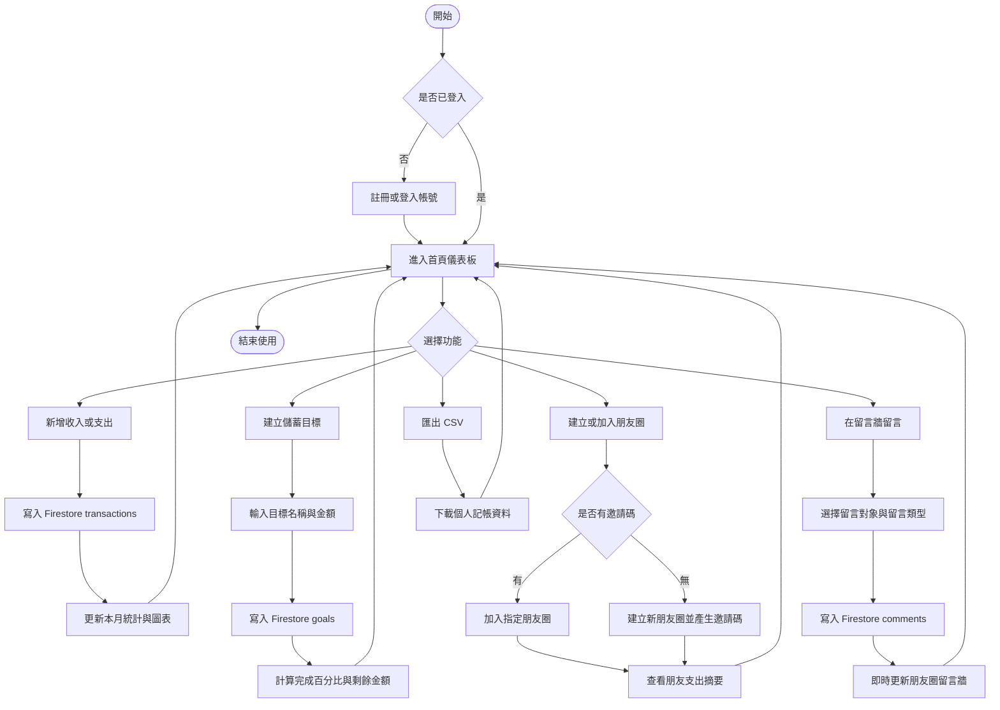

# 步步為盈 StepProfit

## 網頁程式期末專題

**專題名稱：** 步步為盈 StepProfit  
**學生姓名：** 顏羽婕  
**學號：** B1229053  

## 專題簡介

「步步為盈 StepProfit」是一個結合個人記帳、儲蓄目標、朋友監督與留言牆的網頁記帳系統。使用者可以在手機或電腦即時記錄收入與支出，設定想達成的目標物，例如新筆電、旅遊基金或生活預備金，並透過朋友圈功能讓朋友互相提醒與鼓勵。

本專題使用 React 建立前端介面，並使用 Firebase 作為後端服務，包含會員登入、雲端資料儲存與即時留言更新。若尚未填入 Firebase 環境變數，系統會自動切換為 Demo 本機模式，方便開發與展示。

## 主要功能

### 1. 會員系統

- 使用者註冊帳號
- 使用者登入與登出
- 個人資料管理
- 設定每月預算
- 每位使用者只能查看與管理自己的完整記帳資料

### 2. 個人記帳

- 新增收入與支出
- 編輯交易紀錄
- 刪除交易紀錄
- 設定交易日期、金額、分類與備註
- 使用月份與分類篩選交易紀錄
- 手機端可即時新增記帳資料

### 3. 統計分析

- 顯示本月收入
- 顯示本月支出
- 顯示本月結餘
- 計算預算使用比例
- 顯示是否接近超支
- 顯示分類支出統計
- 顯示每日支出趨勢

### 4. 儲蓄目標

- 新增目標物，例如新筆電、旅遊基金
- 設定目標金額
- 記錄目前已存金額
- 顯示剩餘金額
- 顯示完成百分比
- 新增存款紀錄
- 編輯或刪除目標

### 5. 朋友圈監督

- 建立朋友圈
- 系統產生邀請碼
- 使用邀請碼加入朋友圈
- 查看圈內朋友的本月支出摘要
- 查看朋友的預算使用比例
- 只顯示統計摘要，不公開每筆明細

### 6. 留言牆

- 在朋友圈留言
- 對指定朋友留言
- 留言類型包含提醒、鼓勵與一般留言
- 顯示留言作者與留言時間
- 使用 Firebase 即時更新留言內容
- 使用者可刪除自己的留言

### 7. 匯出資料

- 匯出自己的記帳資料為 CSV
- 可使用 Excel 或 Google Sheets 開啟
- 方便備份與後續整理

### 8. 手機版使用

- 響應式網頁設計
- 手機版底部導覽列
- 快速記帳介面
- 可部署後由手機瀏覽器直接使用

## 使用技術

- React
- React Router
- Firebase Authentication
- Firebase Firestore
- Firebase Hosting 或 Vercel
- CSS RWD 響應式設計
- CSV 匯出

## React 架構說明

本專題是 React + Vite 架構，不是單純 HTML/CSS/JavaScript 頁面。

### 入口檔案

- `index.html` 載入 `/src/main.jsx`
- `src/main.jsx` 使用 `createRoot` 將 `<App />` 掛載到 `#root`
- `src/App.jsx` 負責設定 Provider 與 React Router 路由

### 路由設計

使用 `react-router-dom` 建立單頁應用程式：

- `/`：總覽
- `/transactions`：記帳紀錄
- `/analytics`：統計分析
- `/goals`：儲蓄目標
- `/circle`：朋友圈與留言牆
- `/settings`：個人設定

### Component 拆分

本專題將畫面拆成可重複使用的 React component：

- `Layout.jsx`：側邊欄、主版面、同步狀態
- `PageHeader.jsx`：每頁標題區
- `StatCard.jsx`：收入、支出、結餘卡片
- `CalendarPanel.jsx`：本月收支月曆
- `pages/*.jsx`：各功能頁面

### State 與資料流

使用 React Hooks 與 Context 管理狀態：

- `AuthContext.jsx`：管理 Firebase 登入、註冊、登出與登入狀態
- `AppDataContext.jsx`：集中管理記帳、目標、留言、個人設定
- `useState`：管理表單輸入、圖表切換、編輯狀態
- `useMemo`：計算統計數字、分類比例、月份曲線資料
- `useEffect`：監聽 Firebase Auth 與 Firestore 即時資料

### Firebase 資料流

畫面不直接操作 Firebase，而是呼叫 Context 提供的方法：

```txt
使用者操作畫面
  -> 呼叫 AppDataContext 方法
  -> 判斷 Firebase 是否可用
  -> Firebase 模式：寫入 Firestore
  -> Demo 模式：寫入 localStorage
  -> React state 更新畫面
```

## Firebase 設定方式

1. 到 Firebase Console 建立專案
2. 啟用 Authentication 的 Email/Password 登入
3. 建立 Firestore Database
4. 複製 `.env.example` 為 `.env.local`
5. 將 Firebase Web App 設定填入 `.env.local`
6. 重新啟動 `npm run dev`

```env
VITE_FIREBASE_API_KEY=your-api-key
VITE_FIREBASE_AUTH_DOMAIN=your-project.firebaseapp.com
VITE_FIREBASE_PROJECT_ID=your-project-id
VITE_FIREBASE_STORAGE_BUCKET=your-project.appspot.com
VITE_FIREBASE_MESSAGING_SENDER_ID=your-sender-id
VITE_FIREBASE_APP_ID=your-app-id
```

系統會依照 Firebase 是否設定完成切換資料模式：

- Firebase 已設定且已登入：使用 Firebase Authentication 與 Firestore
- Firebase 未設定：使用 localStorage Demo 模式

### Firebase 在本專題中的實作位置

- `src/firebase/config.js`：讀取 Vite 環境變數，判斷 Firebase 是否設定完成
- `src/context/AuthContext.jsx`：處理註冊、登入、登出，註冊後建立 `users/{uid}`
- `src/context/AppDataContext.jsx`：集中處理 Firestore 讀寫與 localStorage Demo fallback
- `firestore.rules`：限制使用者只能管理自己的交易、目標與個人資料
- `src/pages/Settings.jsx`：顯示 Firebase 連線狀態與缺少的 env key

### Firestore 實際使用的 collections

- `users/{uid}`：個人名稱、每月預算、聯絡方式、頭像設定
- `transactions`：收入與支出紀錄，使用 `userId` 對應登入者
- `goals`：儲蓄目標與存款紀錄，使用 `userId` 對應登入者
- `comments`：朋友圈留言牆，使用 `authorId` 紀錄留言者

### Firestore Rules 部署

將 `firestore.rules` 的內容貼到 Firebase Console：

```txt
Firestore Database
  -> Rules
  -> 貼上 firestore.rules
  -> Publish
```

或使用 Firebase CLI：

```bash
firebase deploy --only firestore:rules
```

## 資料庫規劃

```txt
users
  uid
  name
  email
  monthlyBudget
  createdAt

transactions
  id
  userId
  type: income / expense
  amount
  category
  note
  date
  createdAt

goals
  id
  userId
  title
  targetAmount
  currentAmount
  targetDate
  note
  status
  createdAt
  updatedAt

circles
  id
  name
  inviteCode
  ownerId
  memberIds
  createdAt

comments
  id
  circleId
  targetUserId
  authorId
  authorName
  type: reminder / encouragement / normal
  content
  createdAt
```

## 活動圖



## 專題重點

本專題重點不只在完成畫面，而是說明每個功能如何實作：

- 如何使用 React Router 建立多頁式單頁應用
- 如何使用 Firebase Authentication 判斷登入狀態
- 如何使用 Firestore 儲存每位使用者的記帳資料
- 如何用 `userId` 隔離不同使用者資料
- 如何用 JavaScript 計算收入、支出、結餘與預算比例
- 如何設計朋友圈資料結構
- 如何只分享朋友的統計摘要，避免公開完整消費明細
- 如何用 Firestore 即時監聽留言牆
- 如何設計手機端也能使用的 RWD 介面
