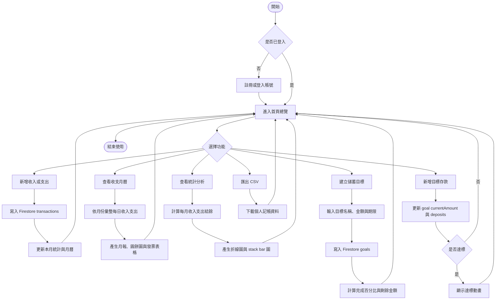

# 步步為盈 StepProfit

## 網頁程式期末專題

**專題名稱：** 步步為盈 StepProfit  
**學生姓名：** 顏羽婕  
**學號：** B1229053  

## 專題簡介

「步步為盈 StepProfit」是一個個人記帳與儲蓄目標管理系統。使用者可以在手機或電腦即時記錄收入與支出，設定每月預算，查看月曆與統計圖表，並把結餘分配到想達成的目標，例如新筆電、旅遊基金或生活預備金。

本專題使用 React 建立前端介面，並使用 Firebase 作為後端服務，包含會員登入與 Firestore 雲端資料儲存。若尚未填入 Firebase 環境變數，系統會自動切換為 localStorage Demo 模式，方便開發與展示。

## 主要功能

### 1. 會員系統

- 使用者註冊、登入與登出
- 使用 Firebase Authentication Email/Password
- 註冊後建立個人資料
- 每位使用者只能讀寫自己的記帳、目標與設定資料

### 2. 個人記帳

- 新增收入與支出
- 編輯與刪除交易紀錄
- 設定交易日期、金額、分類與備註
- 收入分類：打工、直播、接委託、其他
- 支出分類：餐飲、交通、娛樂、購物、學習、儲蓄目標、其他
- 匯出 CSV，可用 Excel 或 Google Sheets 開啟

### 3. 預算與總覽

- 顯示本月收入、本月支出、本月結餘
- 設定本月可花費預算
- 超出預算或結餘為負數時顯示提醒
- 顯示累計收入、累計支出、累計結餘
- 顯示目前全部目標存款與整體目標進度

### 4. 收支月曆

- 以月曆方式顯示每日收入與支出
- 可切換上個月、本月、下個月
- 月報分頁顯示該月收入、支出、結餘、交易筆數
- 支出分類以圓餅圖呈現
- 支出明細以發票樣式表格呈現

### 5. 統計分析

- 折線圖顯示每月收入、支出、結餘
- 點選收入、支出或結餘時，其他曲線淡化
- 直式 stack bar 圖顯示每月收入、支出、存入目標
- 顯示目前全部存款
- 顯示每月平均與累計支出分類比例
- 顯示最高收入月份、最高支出月份、結餘最好月份與最大支出分類

### 6. 儲蓄目標

- 新增目標物，例如新筆電、畢旅基金
- 設定目標金額、期限與備註
- 顯示目前已存、剩餘金額與完成百分比
- 可新增、編輯、取消存款紀錄
- 達標時顯示慶祝動畫
- 可從總覽將本月可分配結餘存入目標

### 7. 個人設定

- 修改使用者名稱與每月預算
- 顯示 Firebase 連線狀態

## 使用技術

- React
- Vite
- React Router
- Firebase Authentication
- Firebase Firestore
- CSS RWD 響應式設計
- SVG / CSS chart
- CSV 匯出

## React 架構說明

本專題是 React + Vite 架構，不是單純 HTML/CSS/JavaScript 頁面。

### 入口檔案

- `index.html` 載入 `/src/main.jsx`
- `src/main.jsx` 使用 `createRoot` 將 `<App />` 掛載到 `#root`
- `src/App.jsx` 負責設定 Provider 與 React Router 路由

### 路由設計

使用 `react-router-dom` 建立單頁應用程式：

- `/`：總覽
- `/transactions`：記帳紀錄與 CSV 匯出
- `/monthly`：收支月曆與月報
- `/analytics`：統計分析
- `/goals`：儲蓄目標
- `/settings`：個人設定

### Component 拆分

- `Layout.jsx`：側邊欄、主版面、同步狀態
- `PageHeader.jsx`：每頁標題區
- `StatCard.jsx`：收入、支出、結餘卡片
- `CalendarPanel.jsx`：月曆、月報、支出圓餅圖與發票表格
- `pages/*.jsx`：各功能頁面

### State 與資料流

- `AuthContext.jsx`：管理 Firebase 登入、註冊、登出與登入狀態
- `AppDataContext.jsx`：集中管理記帳、目標與個人設定
- `useState`：管理表單輸入、圖表切換、編輯狀態
- `useMemo`：計算統計數字、分類比例、月份曲線資料
- `useEffect`：監聽 Firebase Auth 與 Firestore 即時資料

## Firebase 設定方式

1. 到 Firebase Console 建立專案
2. 啟用 Authentication 的 Email/Password 登入
3. 建立 Firestore Database
4. 複製 `.env.example` 為 `.env.local`
5. 將 Firebase Web App 設定填入 `.env.local`
6. 重新啟動 `npm run dev`

```env
VITE_FIREBASE_API_KEY=your-api-key
VITE_FIREBASE_AUTH_DOMAIN=your-project.firebaseapp.com
VITE_FIREBASE_PROJECT_ID=your-project-id
VITE_FIREBASE_STORAGE_BUCKET=your-project.appspot.com
VITE_FIREBASE_MESSAGING_SENDER_ID=your-sender-id
VITE_FIREBASE_APP_ID=your-app-id
```

### Firebase 在本專題中的實作位置

- `src/firebase/config.js`：讀取 Vite 環境變數，判斷 Firebase 是否設定完成
- `src/context/AuthContext.jsx`：處理註冊、登入、登出，註冊後建立 `users/{uid}`
- `src/context/AppDataContext.jsx`：集中處理 Firestore 讀寫與 localStorage Demo fallback
- `firestore.rules`：限制使用者只能管理自己的交易、目標與個人資料

### Firestore 使用的 collections

- `users/{uid}`：個人名稱、Email 與每月預算
- `transactions`：收入與支出紀錄，使用 `userId` 對應登入者
- `goals`：儲蓄目標與存款紀錄，使用 `userId` 對應登入者

## 資料庫規劃

```txt
users
  uid
  displayName
  email
  monthlyBudget
  createdAt
  updatedAt

transactions
  id
  userId
  type: income / expense
  amount
  category
  note
  date
  createdAt

goals
  id
  userId
  title
  targetAmount
  currentAmount
  targetDate
  note
  deposits
```

## 活動圖



## 專題重點

- 如何使用 React Router 建立多頁式單頁應用
- 如何使用 Firebase Authentication 判斷登入狀態
- 如何使用 Firestore 儲存每位使用者的個人記帳資料
- 如何用 `userId` 隔離不同使用者資料
- 如何用 JavaScript 計算收入、支出、結餘、預算比例與月平均
- 如何將交易資料轉成月曆、折線圖、stack bar 圖與圓餅圖
- 如何設計儲蓄目標的存款紀錄、進度條與達標動畫
- 如何設計手機端也能使用的 RWD 介面
