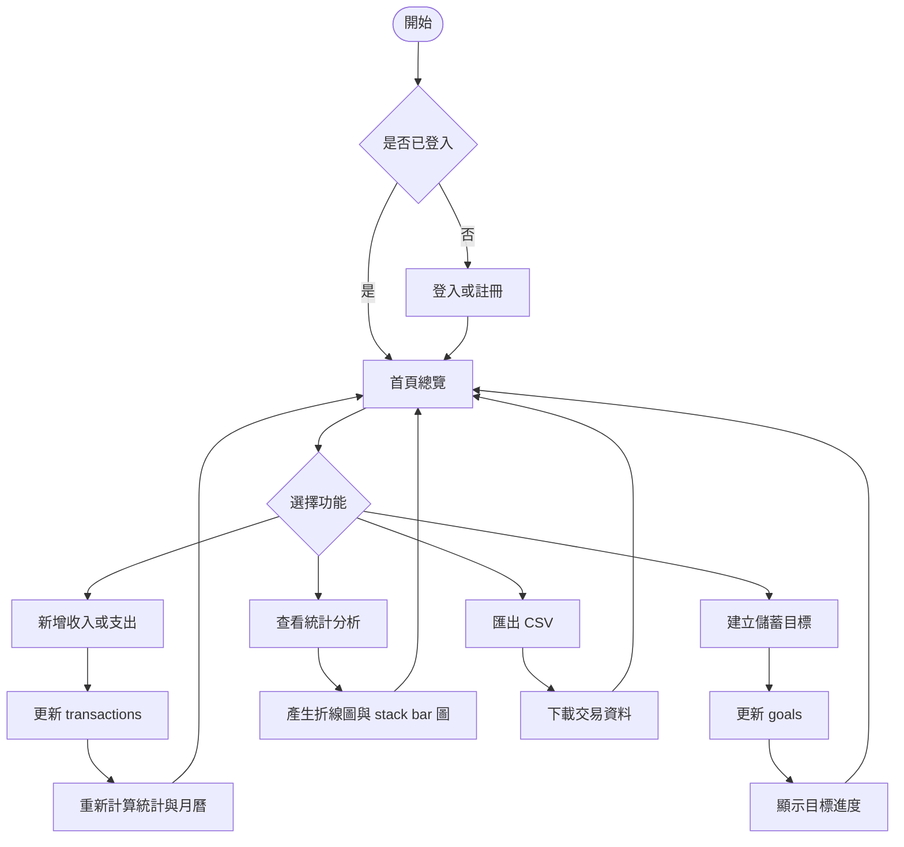

# 步步為盈 StepProfit 設計書

## 專題定位

步步為盈 StepProfit 是網頁程式期末專題，主題為個人記帳、預算控管、統計分析與儲蓄目標管理。

## 核心資料

- `users`：使用者資料、每月預算與頭像設定
- `transactions`：收入與支出紀錄
- `goals`：儲蓄目標與目標存款紀錄

## 頁面規劃

- 登入 / 註冊
- 首頁總覽
- 記帳紀錄
- 收支月曆
- 統計分析
- 儲蓄目標
- 個人設定

## 實作重點

- React component 拆分
- React Router 巢狀路由
- Firebase Authentication 登入
- Firestore CRUD
- 使用 `userId` 區分每個人的資料
- 使用 `reduce` 與 `useMemo` 計算統計資料
- 使用 SVG / CSS 製作折線圖、stack bar 圖與圓餅圖
- RWD 手機版介面

## Firebase 實作設計

系統會先讀取 `.env.local` 的 Firebase Web App 設定。若設定完整，啟用 Firebase Auth 與 Firestore；若缺少設定，系統保留 Demo 本機模式，方便課堂展示。

```txt
.env.local
  -> src/firebase/config.js
  -> AuthContext 判斷登入狀態
  -> AppDataContext 決定使用 Firestore 或 localStorage
```

### Auth

- 使用 Email / Password 註冊與登入
- 註冊成功後建立 `users/{uid}`
- 登出後清除目前登入狀態

### Firestore

- `transactions` 使用 `userId` 過濾，只讀取自己的記帳資料
- `goals` 使用 `userId` 過濾，只讀取自己的儲蓄目標
- `users/{uid}` 儲存個人設定

### 安全規則

Firestore rules 限制：

- 個人資料只能本人讀寫
- 交易資料只能本人新增、修改、刪除
- 目標資料只能本人新增、修改、刪除

## React 實作架構

本專題使用 React + Vite 建立，入口為 `src/main.jsx`，透過 `createRoot` 掛載 `App`。

```txt
main.jsx
  -> App.jsx
    -> AuthProvider
    -> AppDataProvider
    -> BrowserRouter
    -> Layout
    -> pages
```

### 主要資料流

```txt
Page Component
  -> useAppData / useAuth
  -> Context function
  -> Firestore 或 localStorage
  -> setState
  -> React re-render
```

### 使用到的 React 功能

- JSX component
- `useState`
- `useEffect`
- `useMemo`
- `createContext`
- React Router 巢狀路由

## 活動流程


